# Enterprise AI Receptionist — Master Implementation Guide

**What this is:** one complete, start-to-finish walkthrough for standing up the
whole platform — the real-time voice layer (Vapi + `vapi-realtime-platform`)
*and* the background automation layer (n8n) — in the order you actually need
to do it in. Earlier you had two separate documents covering each half; this
one replaces reading them separately. The deeper "why we built it this way"
material from the original architecture guide is kept, just moved to the
**Reference** section at the end so the front of this document stays a clean
numbered process.

**Audience:** whoever is setting this up — no assumed coding background for
the process sections; the Reference section is more technical and is there for
whoever maintains the code.


---

## How the whole system fits together



A caller dials a business's number. **Vapi** answers, transcribes, and carries
the conversation. Anything that needs real data — "am I an existing customer,"
"is 2pm free," "book it," "this is an emergency" — goes to **one small API**
(`vapi-realtime-platform`) that answers in well under a second and never makes
the caller wait on anything else. After the call, that same API quietly tells
**n8n** what happened; n8n handles everything that isn't time-critical —
texting/emailing customers and staff, logging to each client's Google Sheet,
Slack alerts. The caller is never waiting on n8n; n8n is never in the live
call path at all.

That split — instant real-time layer vs. background automation layer — is the
one idea worth holding onto as you go through the phases below.

---

## Prerequisites

Have these ready (accounts/credentials) before starting:

- A **Vapi** account and API key
- A **Supabase** project (Postgres database)
- A **Redis** instance (Upstash or similar)
- A **Pinecone** index for the knowledge base
- A **Google Cloud** OAuth2 client with the Calendar API enabled
- An **always-on host** for the real-time API (Fly.io assumed below — any
  always-on container host works; avoid scale-to-zero serverless, explained in
  Reference §3.5)
- Your **n8n** instance (already built)
- **Twilio**, **Gmail**, and **Slack** accounts/credentials for notifications
- A **Google account** with edit access to each client's Google Sheet (create
  one per client as you onboard them)

---

## Phase 1 — Provision the database

1. Run the SQL migrations against your Supabase Postgres project, in order:
   `src/db/migrations/001_init.sql`, `002_n8n_integration_fields.sql`,
   `003_google_sheets_fields.sql` (all in `vapi-realtime-platform/`). Together
   these create every table the platform needs — businesses, locations,
   calendars, customers, appointments, calls, audit logs, and the
   `google_sheet_id`/`slack_channel` fields used later in Phase 5.
2. Create the **Pinecone** index — dimension **1536** (matches the
   `text-embedding-3-small` embedding model), metric cosine. One namespace per
   business, named after that business's `slug`.
3. Stand up **Redis** and note its connection URL. This is the hot-path cache
   (tenant lookups, business hours, FAQ cache, booking idempotency) — see
   Reference §13 for exactly what's cached and why.

---

## Phase 2 — Deploy the real-time API

This is the `vapi-realtime-platform/` service — the thing Vapi actually talks
to during a live call.

1. `cp .env.example .env` and fill in every value: Supabase, Redis, Pinecone,
   OpenAI (embeddings only — the live conversation model is configured
   separately, directly in Vapi), your Google OAuth2 client id/secret,
   `N8N_BASE_URL` + shared secret, `INTERNAL_API_SHARED_SECRET`, and a strong
   random `VAPI_WEBHOOK_SECRET`.
2. Locally: `npm install && npm run build && npm test && npm run typecheck` —
   confirm a clean baseline before deploying anything.
3. Deploy it somewhere **always-on** — `fly deploy` with the provided
   `fly.toml`/`Dockerfile` if using Fly.io, or your own always-on host. Do not
   use scale-to-zero serverless (Lambda/Cloud Run default settings) — a cold
   start landing inside a live call would blow the response-time budget.
4. Confirm `GET https://<your-host>/healthz` returns `200`.

---

## Phase 3 — Onboard a business and create its Vapi assistant

1. **Add the business to the database:**
   - Insert a row into `businesses` (name, slug, vertical, timezone,
     change-cutoff-hours, emergency policy).
   - Insert its `locations` row(s), marking one primary.
   - Insert its `calendars` row (Google Calendar id + OAuth2 refresh token).
   - (`phone_numbers` and `google_sheet_id` get filled in during Phases 4 and 5.)
2. **Load its knowledge base:** ingest FAQ/policy documents into Pinecone under
   that business's namespace (its `slug`), **and** upload the same documents to
   Vapi's own native Knowledge Base for this business. Uploading to both
   matters: Vapi's native KB answers questions with zero extra network hop
   (fastest path); Pinecone is the fallback for anything the native KB misses,
   and the single source of truth if you ever need to audit or re-version the
   knowledge later.
3. **Generate and push the Vapi assistant:**
   ```
   VAPI_API_KEY=... REALTIME_API_SERVER_URL=https://<your-host>/webhooks/vapi \
   VAPI_WEBHOOK_SECRET=<same as .env> npx tsx scripts/provisionAssistant.ts <businessId>
   ```
   This fills in the generic assistant template with this business's data and
   its industry's prompt (dental, chiropractic, med spa, physiotherapy, HVAC,
   plumbing, or law firm — see Reference §16), pushes it to Vapi, and records
   the resulting assistant id.
4. In the Vapi dashboard, spot-check the new assistant: `server.url` and
   `server.secret` are set, the voice/model look right, and the native
   Knowledge Base from step 2 is attached if you're using it.

---

## Phase 4 — Connect the phone number

1. Vapi dashboard → **Phone Numbers** → import your Twilio (or Vapi-native)
   number.
2. Assign the assistant from Phase 3 to that number.
3. Copy the resulting Vapi `phoneNumberId` into that business's `phone_numbers`
   row in the database — this is what lets one platform correctly route calls
   for a business with multiple locations sharing one assistant.

At this point, calling the number should reach the AI assistant and it should
be able to look up customers, check availability, and answer FAQs. Background
notifications (texts, Sheets logging, Slack) won't fire yet — that's Phase 5.

---

## Phase 5 — Import and connect the 9 n8n background workflows

Everything in this phase happens **after** a call has already ended — nothing
here is on the live-call path. The real-time API quietly tells n8n what
happened; n8n does the rest.


| # | File | Fires when | What it does |
|---|---|---|---|
| 1 | `01-call-completed.json` | Every call ends (normal conversation) | Logs the call to the client's Sheet, AI-summarizes it, pings staff if it needs follow-up |
| 2 | `02-missed-call.json` | A call ends as voicemail/no-answer | Texts the caller back, emails/Slacks staff, logs it to the client's Sheet |
| 3 | `03-appointment-booked.json` | AI tentatively holds a time slot | Texts customer "request received," logs it to the client's Sheet, pings staff to confirm |
| 4 | `04-appointment-confirmed.json` | **Staff** confirm a booking | Sends the real "you're confirmed" text + email, updates the Sheet row and your records |
| 5 | `05-appointment-change.json` | Caller cancels/reschedules | If straightforward: confirms the change. If last-minute or unclear: tells the customer staff will follow up, pings staff urgently |
| 6 | `06-emergency-alert.json` | AI flags an emergency | Texts + emails your on-call number immediately, logs it to the client's Sheet, Slacks the team |
| 7 | `07-handoff-alert.json` | Caller asks for a real person | Emails staff, logs it to the client's Sheet, Slacks the team |
| 8 | `08-kb-upload.json` | You upload/update a knowledge document | Splits it into chunks, creates embeddings, stores it in Pinecone, tells the real-time API to stop using old cached answers |
| 9 | `09-patient-followup.json` | Scheduled (per business) | Sends review-request texts a few days after a completed visit |

Import workflows 1–8 as regular workflows (each has its own webhook trigger).
Workflow 9 is different — see "Workflow 9 is different" below.

### Step 5a — Create each client's Google Sheet

Create **one Google Sheet per client**, then put its ID (the long string in
the sheet's URL) into that business's `google_sheet_id` field in the database.
Add these tabs, with headers in row 1 exactly as named:

| Tab name | Written by | Columns |
|---|---|---|
| `Call_Log` | Workflow 1 | `call_id`, `timestamp`, `customer_name`, `customer_phone`, `recording_url`, `duration_sec`, `transcript`, `summary`, `sentiment`, `action_items` |
| `Missed_Calls` | Workflow 2 | `timestamp`, `call_id`, `caller_phone`, `reason`, `voicemail_url`, `staff_notified` |
| `Bookings` | Workflows 3 & 4 | `appointment_id`, `timestamp`, `customer_name`, `customer_phone`, `service`, `start_time`, `status`, `confirmed_at` |
| `Appointment_Changes` | Workflow 5 | `timestamp`, `customer_name`, `customer_phone`, `action`, `status`, `reason`, `new_time` |
| `Emergencies` | Workflow 6 | `timestamp`, `caller_phone`, `issue_summary`, `severity`, `action_taken` |
| `Handoffs` | Workflow 7 | `timestamp`, `caller_phone`, `caller_email`, `reason` |

`Bookings` is written by two different workflows on purpose: workflow 3
creates the row when the AI tentatively holds a slot (`status = tentative`),
and workflow 4 updates that *same row* (matched by `appointment_id`) once
staff confirm (`status = confirmed`) — one row per appointment, not two.

### Step 5b — Credentials to set up in n8n

| Credential | Used by | Notes |
|---|---|---|
| Supabase | most workflows | internal logs only, not client-visible history |
| Google Sheets OAuth2 | Workflows 1, 2, 3, 4, 5, 6, 7 | connect a Google account with edit access to every client's spreadsheet |
| Gmail | Workflows 1, 2, 4, 6, 7 | staff-facing emails |
| Twilio | Workflows 2, 3, 4, 5, 6, 9 | customer-facing texts |
| Slack | every workflow | team notifications |
| OpenAI | Workflow 1 (summarizing), Workflow 8 (embeddings) | |
| Pinecone | Workflow 8 | knowledge base storage |
| Internal API Key (HTTP Header Auth) | Workflow 8's cache-flush step | header `x-internal-secret`, value must match the real-time API's `INTERNAL_API_SHARED_SECRET` |

### Step 5c — Environment variables n8n needs

- `TWILIO_FROM_NUMBER` — the number texts are sent from
- `FRONT_DESK_ALERT_EMAIL` — where staff email alerts go
- `FRONT_DESK_ALERT_PHONE` — where the Emergency Alert text goes
- `REALTIME_API_BASE_URL` — the real-time API's base URL (used by workflow 8's
  cache-flush step)

There's no variable for which Sheet belongs to which client — that arrives
automatically in every event's `sheetId` field, straight from that business's
`google_sheet_id` setting.

### Step 5d — How staff confirm a booking (workflow 4)


Workflow 4 needs *something* to call it once a staff member has actually
confirmed the appointment — pick whichever is easiest:

- **Simplest:** a GoHighLevel (GHL) automation, if you use GHL for pipeline
  tracking, firing this webhook when an appointment's stage moves to
  "Confirmed." (GHL is no longer where notes/tasks get written — Sheets does
  that now — but it's still a fine way to *trigger* this step if you already
  use it for pipeline management.)
- **Also simple:** any basic web form or button your front desk clicks that
  sends the appointment's details to this webhook.

Whichever you pick, send the same fields as workflow 3 (customer name/phone/
email, appointment time, service, business name, sheet ID).

### Step 5e — How cancel/reschedule decisions work (workflow 5)



The phone system only makes the change itself when it's confident and there's
enough notice; otherwise it hands it to staff rather than guessing.

### Step 5f — Default Slack channels

If a business doesn't have a custom `slackChannel` set, these are the
fallbacks: `#calls`, `#missed-calls`, `#bookings` (booked and confirmed),
`#appointment-changes`, `#emergencies`, `#handoffs`, `#kb-updates`,
`#followups`. Error alerts always go to `#automation-alerts`.

### Step 5g — What still lives in Supabase (not the client's Sheet)

Client-visible history (calls, bookings, cancellations, emergencies, handoffs)
lives in each client's Google Sheet — that's what staff should read day to
day. Supabase still holds a few internal-only tables these workflows use:
`follow_up_tasks`, `appointments` (the platform's own booking records),
`kb_document_versions`, `audit_log`, `workflow_execution_log`,
`workflow_errors`. None of these are meant to be opened directly by staff.

### Step 5h — The "Has Sheet ID?" safety check

Every workflow that writes to a Sheet checks first whether that business has
one configured. If not, it skips just that one step and everything else still
runs (texts, emails, Slack) — nothing errors or gets stuck.

### Workflow 9 is different

`09-patient-followup.json` isn't triggered by the real-time API at all — it's
called by a small per-business "shell" workflow that holds that business's own
Schedule Trigger (its own cron/timezone) and passes in `businessId`, `sheetId`,
`followUpDaysAfter`, `reviewLink`, `slackChannel`. Clone the shell per business
rather than duplicating the master workflow.

---

## Phase 6 — Test end-to-end, then go live

Work through these before pointing a number at real customers. The first
block exercises the real-time (Vapi) side; the second exercises the
background (n8n/Sheets) side; run them together so you can see one call's
effects ripple all the way through.

**Real-time behavior:**

1. New caller, no record → recognized as new → book an appointment → assistant
   says it's *tentatively* holding the time, never "booked."
2. Same caller calls back → recognized, greeted by name.
3. Ask to book a slot known to be taken → assistant offers another time, never
   double-books.
4. Ask to cancel an appointment inside the change-cutoff window → assistant
   says the team will confirm, never claims it's done.
5. Ask to cancel an appointment outside the window → cancelled directly,
   confirmed on the call.
6. Describe that vertical's emergency scenario → correct action fires (live
   transfer vs. log-and-notify) based on business policy and the hard-keyword
   safety net.
7. Ask a question answerable from the native Knowledge Base → answered with no
   Pinecone call (check logs).
8. Ask a question only in Pinecone → answered via the fallback, confidence
   gate respected.
9. Ask something in neither → assistant says it's not sure, never invents an
   answer.
10. Say "let me talk to a person" → handoff fires.
11. Ask outside business hours → after-hours message appended.
12. Two different businesses in the same test session → confirm business A's
    assistant can never see business B's data (the single most important test
    at multi-tenant scale).

**Background/Sheets behavior (for each real-time scenario above, confirm):**

13. The booking scenario (#1) produced a `tentative` row in `Bookings`, and the
    customer got a "we've received your request" text — not "confirmed."
14. Triggering workflow 4 manually for that same appointment sends the real
    "confirmed" text/email and updates that *same* `Bookings` row — not a
    second row.
15. The cutoff-window cancellation (#4) produced a row in
    `Appointment_Changes` with `status = escalated`, plus an urgent Slack ping.
16. The outside-window cancellation (#5) produced a row with `status = done`.
17. The emergency scenario (#6) produced a row in `Emergencies` and fired the
    on-call phone/email/Slack.
18. The handoff scenario (#10) produced a row in `Handoffs`.
19. Let a test call go to voicemail → callback text fires and a row appears in
    `Missed_Calls`.
20. Upload a test knowledge document → it appears in Pinecone, `#kb-updates`
    posts; then break it on purpose (bad file) → confirm `#automation-alerts`
    fires instead of the workflow silently failing.
21. Temporarily remove a test business's `google_sheet_id` → confirm every
    workflow still completes (texts/emails/Slack still fire), just without a
    Sheets row — nothing should error.
22. Force a Pinecone/Calendar outage in staging (revoke a test credential) →
    confirm graceful degradation on the call, not dead air or a hard error.
23. Retry a booking tool call twice with the same call id (simulate a network
    blip) → confirm exactly one calendar event and one `Bookings` row, not two.

Once this passes for one business, repeat Phases 3–6 for each additional
business — nothing in Phases 1–2 repeats; that's the point of the shared,
tenant-resolved design.

---

## Reference

The sections below are the deeper "why we built it this way" material — useful
for whoever maintains the code, not required reading to get the platform
running.

### R1. Key architectural decisions

- **Node.js + TypeScript + Fastify for the real-time API.** Fastify's overhead
  is sub-millisecond per request and Node's non-blocking I/O suits a service
  that's mostly waiting on network calls (Pinecone, Calendar, Postgres, Redis).
  Considered Python/FastAPI (comparable performance, but weaker ecosystem fit)
  and Go (fastest, but slower to iterate/hire for). Trade-off: a CPU-heavy bug
  could stall the single-threaded event loop — mitigated by keeping all
  hot-path logic I/O-bound and a hard 5s request timeout.
- **Supabase (Postgres) + Redis, not n8n's own data nodes.** The real-time path
  can't afford n8n's per-execution overhead for a simple lookup. Postgres
  gives relational integrity (with Row-Level Security as defense-in-depth);
  Redis gives sub-millisecond reads for things checked on every turn. Running
  two systems instead of one is justified because they have fundamentally
  different jobs — durable system-of-record vs. hot ephemeral cache.
- **One shared webhook URL + server-side tenant resolution, not one URL per
  business.** Vapi's payloads carry `assistantId`/`phoneNumberId`, enough to
  resolve business + location server-side. A URL-per-business scheme would
  mean an infrastructure change for every new customer. Trusting the LLM to
  pass a raw `businessId` was rejected outright — that's a security/tenant
  boundary that shouldn't depend on the model behaving.
- **Vapi's native Knowledge Base as primary FAQ path, Pinecone as fallback.**
  The native KB is queried in-process with zero extra hop; Pinecone is the
  fallback for what it misses, and the durable, versioned source of truth
  (the same ingestion pipeline populates both).
- **Fly.io (always-on), not scale-to-zero serverless.** A cold start landing
  inside a live call's tool-call round trip would blow the latency budget
  unpredictably — the worst kind of bug to chase from call-quality complaints.

### R2. Intent routing

Two layers, not one. **Vapi's own function-calling is the primary router** —
the system prompt per vertical (`vapi-templates/prompts/*.md`) describes each
tool and when to use it, inside Vapi's own latency-optimized pipeline (adding
a separate classify-then-route hop would double LLM round trips per turn — not
viable for a live call). **Deterministic guardrails inside each endpoint are
the safety net**, because an LLM's judgment isn't trusted for anything safety-
or money-critical: `/knowledge/search` enforces a hard confidence floor before
answering; `/emergency-routing` re-checks the issue text against a small
hard-transfer keyword list regardless of what the model classified; booking
and cancellation endpoints enforce the tentative-only and change-cutoff rules
in code, not in the prompt. Small talk never triggers a tool call at all — no
Pinecone query, no downstream API hit, for greetings or chit-chat.

### R3. The real-time API contracts

All under strict per-endpoint timeouts, circuit-broken, cached where it helps:

| Endpoint | Purpose | Budget |
|---|---|---|
| `POST /knowledge/search` | Fallback FAQ retrieval (Pinecone) when the native KB doesn't answer | 450ms |
| `POST /calendar/check` | Read-only availability probe before offering a time | 900ms |
| `POST /calendar/book` | The only endpoint that writes a calendar event + DB row; always tentative | 900ms |
| `POST /calendar/cancel` / `/calendar/reschedule` | Cancel/move, subject to the change-cutoff escalation rule | 900ms |
| `GET /business-hours` | Open/closed status for after-hours disclaimers | ~1ms cached |
| `POST /emergency-routing` | The only endpoint allowed to trigger a live transfer | ~10-30ms + async |
| `POST /customer-validation` | Fast identity lookup for personalization | ~1ms cached |

Full request/response shapes, validation rules, and error-handling detail per
endpoint live in the source (`src/routes/*.ts`, `src/schemas/*.ts`) — kept
there rather than duplicated here so the contract and the code can't drift
apart.

### R4. The Vapi webhook contract

One route, `POST /webhooks/vapi`, secret-verified. Two message types: `tool-calls`
(mid-call, dispatched in-process — not looped back through the public REST
routes, to avoid a pointless extra network hop on every single tool call) and
`end-of-call-report` (once, after hangup — does one fast internal DB write,
then hands everything else to n8n). See `src/routes/vapiWebhook.ts`.

### R5. Multi-vertical support

One codebase, one deploy, seven verticals today (dental, chiropractic, med
spa, physiotherapy, HVAC, plumbing, law firm) — differentiated by a per-
vertical prompt file (tone, emergency definition, legal/medical-advice
guardrails) and a per-business config row (cutoff hours, emergency policy).
`scripts/provisionAssistant.ts` merges the two into a concrete Vapi assistant.
Onboarding a new vertical means writing one new prompt file, not forking the
service.

### R6. Security

| Layer | Mechanism |
|---|---|
| Vapi → this service | Shared secret, constant-time compared |
| Non-Vapi callers | Hashed API key, scoped to one business |
| Tenant isolation | Every query filters by `business_id` in app code, plus Postgres RLS as a second layer |
| Secrets | Env-only, validated at boot; Calendar refresh tokens stored encrypted |
| Rate limiting | Per-business token bucket — one tenant's spike can't starve another's latency |
| PII | Phone/email only; recordings/transcripts stay in Vapi/n8n/Sheets, not duplicated here |
| Webhook replay | `end-of-call-report` upserts on the unique call id — a redelivery updates, never duplicates |

### R7. Error handling & graceful degradation

Uniform response envelope (`{ ok, data?, error?, meta? }`) everywhere. The one
rule that matters most: a caller must never experience silence or a hard
failure because a downstream system hiccupped. A Pinecone timeout, for
example, is caught inside the service and turned into "not sure, I'll have the
team follow up" — never a dead tool call.

### R8. Caching strategy

Tenant resolution, business hours, FAQ answers, and customer lookups are all
Redis-cached with short TTLs (2–10 minutes) since the underlying data changes
rarely; booking idempotency uses a 24-hour claim key so a retried tool call
can never double-book. All cache invalidation is time-based rather than
event-based in v1 — simpler to reason about at scale than wiring cache-busting
into every write path.

### R9. Scalability plan

Stateless API instances scale horizontally with no sticky sessions. Postgres
scales via read replicas/pooling; Redis via a managed cluster (everything in
it is disposable/rebuildable). Pinecone uses one namespace per business today;
if namespace sprawl ever becomes a real cost/perf issue at very large scale,
the documented fallback is one index per vertical with business id as a
metadata filter instead. n8n scales independently of the real-time path —
that decoupling is the entire reason the two systems were split.

### R10. Monitoring

Structured, per-request logs correlated by call id and business id; Vapi's own
dashboard shows the STT/LLM/TTS/tool-time breakdown per call (first place to
look when a call "feels slow"); alert on P95 latency breaching budget, not
just hard failures — a successful-but-slow tool call is the failure mode this
whole architecture exists to prevent. Circuit-breaker state changes are worth
alerting on directly.

### R11. Folder structure

```
vapi-realtime-platform/
  src/
    config/env.ts                zod-validated env, fails fast at boot
    db/{supabase.ts, migrations/} service-role client + full schema (RLS enabled)
    cache/redis.ts                get/set + idempotency-key claiming
    integrations/                 pinecone.ts, googleCalendar.ts, n8nDispatcher.ts
    middleware/                   tenantResolver.ts, auth.ts, errorHandler.ts
    routes/                       8 public endpoints + /webhooks/vapi + /healthz
    services/, schemas/, utils/   business logic, validation, shared helpers
  scripts/provisionAssistant.ts   generates + pushes one business's Vapi assistant
  vapi-templates/                 assistant-config.template.json + prompts/<vertical>.md
  n8n-workflows/                  the 9 background workflows + diagrams + README
  docs/                           this guide
  test/, Dockerfile, fly.toml
```

### R12. Future scalability considerations

An admin/dashboard product (a thin authenticated UI over the same Supabase
tables) is a natural next step — the RLS policies are already shaped for a
non-service-role client. Prompt versioning already supports multiple versions
per business with rollback as a single update. Usage-based billing can
aggregate off the existing `calls`/`audit_logs` tables without new
instrumentation. Additional calendar providers (Calendly, Acuity) slot in
behind the same calendar-client interface. Additional channels (SMS, web
chat) can reuse `/knowledge/search` and `/customer-validation` today since
they're plain REST, not Vapi-specific.
