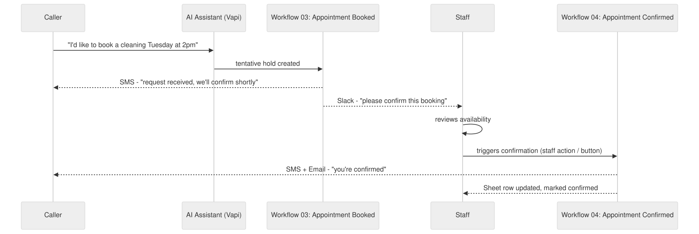

# n8n Background Workflows — Setup Guide (plain-language)

This folder has **9 workflows**. They run *after* the phone call already happened
— nothing here talks to the caller in real time. Import them into n8n in the
order listed below.

*The phone system (Vapi) only ever talks to the real-time API. The API answers
the caller immediately, then separately — without making the caller wait —
tells n8n what happened. n8n is the only thing that talks to Twilio, Gmail,
Slack, each client's Google Sheet, and (for knowledge uploads) Pinecone.*

## What changed from your original 5 files

- **Appointment Booked** no longer texts the customer "confirmed." Every phone
  booking is a *tentative hold* — the customer gets "we've received your
  request, our team will confirm shortly," and your staff get a Slack ping to
  review it.
- **New: Appointment Confirmed.** This is the workflow that sends the real
  "you're confirmed" text/email — but only when a staff member actually
  triggers it (see "How staff confirm a booking" below). This matches what you
  asked for: staff confirm, then the confirmation goes out.
- **New: Emergency Alert, Handoff Alert, Appointment Change (cancel/reschedule).**
  These three didn't exist before. They cover the AI phone system flagging an
  emergency, a caller asking for a real person, and a cancel/reschedule
  request — all of which previously had nowhere to notify your team.
- **GoHighLevel (GHL) has been replaced with Google Sheets — one spreadsheet
  per client.** Every note/task that used to go to GHL now writes a row to that
  client's own Google Sheet instead (see the tab schema below). This only
  changes background, after-the-call logging — nothing about the live phone
  call changes.
- **Call history now lives in each client's Sheet, not Supabase.** The
  `Call_Log` tab replaces the old `call_transcripts`/detailed-`calls` writes.
  (A small internal record still exists in Supabase automatically — see
  "What still lives in Supabase" below — but the transcript, summary, and
  sentiment your staff actually read now live in the client's Sheet.)
- **Knowledge Base Upload** now has the same safety net as your other
  workflows: if something fails partway through, it gets logged and posted to
  `#automation-alerts` instead of failing silently.
- Every workflow that writes to a client's Sheet now **checks first** whether
  that business has one configured. If it doesn't, it skips that one step
  instead of erroring out — nothing else in the workflow is affected.
- Field names in every workflow now match exactly what the phone-answering API
  (`vapi-realtime-platform`) sends. No manual re-mapping needed.

## The 9 workflows, in import order

| # | File | Fires when | What it does |
|---|---|---|---|
| 1 | `01-call-completed.json` | Every call ends (normal conversation) | Logs the call to the client's Sheet, AI-summarizes it, pings staff if it needs follow-up |
| 2 | `02-missed-call.json` | A call ends as voicemail/no-answer | Texts the caller back, emails/Slacks staff, logs it to the client's Sheet |
| 3 | `03-appointment-booked.json` | AI tentatively holds a time slot | Texts customer "request received," logs it to the client's Sheet, pings staff to confirm |
| 4 | `04-appointment-confirmed.json` | **Staff** confirm a booking | Sends the real "you're confirmed" text + email, updates the Sheet row and your records |
| 5 | `05-appointment-change.json` | Caller cancels/reschedules | If it's straightforward: confirms the change. If it's last-minute or unclear: tells the customer staff will follow up, and pings staff urgently |
| 6 | `06-emergency-alert.json` | AI flags an emergency | Texts + emails your on-call number immediately, logs it to the client's Sheet, Slacks the team |
| 7 | `07-handoff-alert.json` | Caller asks for a real person | Emails staff, logs it to the client's Sheet, Slacks the team |
| 8 | `08-kb-upload.json` | You upload/update a knowledge document | Splits it into chunks, creates embeddings, stores it in Pinecone, tells the phone API to stop using the old cached answers |
| 9 | `09-patient-followup.json` | Scheduled (per business) | Sends review-request texts a few days after a completed visit |

Import 1–8 as regular workflows (each has its own webhook trigger). Workflow 9
is a bit different — see below.

## Each client's Google Sheet: the tabs you need to create

Create **one Google Sheet per client** (matches your original build's pattern),
and put its ID (from the sheet's URL) into that business's `google_sheet_id`
field. Add these tabs, with headers in row 1 exactly as named:

| Tab name | Written by | Columns |
|---|---|---|
| `Call_Log` | Workflow 1 | `call_id`, `timestamp`, `customer_name`, `customer_phone`, `recording_url`, `duration_sec`, `transcript`, `summary`, `sentiment`, `action_items` |
| `Missed_Calls` | Workflow 2 | `timestamp`, `call_id`, `caller_phone`, `reason`, `voicemail_url`, `staff_notified` |
| `Bookings` | Workflows 3 & 4 | `appointment_id`, `timestamp`, `customer_name`, `customer_phone`, `service`, `start_time`, `status`, `confirmed_at` |
| `Appointment_Changes` | Workflow 5 | `timestamp`, `customer_name`, `customer_phone`, `action`, `status`, `reason`, `new_time` |
| `Emergencies` | Workflow 6 | `timestamp`, `caller_phone`, `issue_summary`, `severity`, `action_taken` |
| `Handoffs` | Workflow 7 | `timestamp`, `caller_phone`, `caller_email`, `reason` |

`Bookings` is written by two different workflows on purpose: workflow 3 creates
the row when the AI tentatively holds a slot (`status = tentative`), and
workflow 4 updates that *same row* (matched by `appointment_id`) once staff
confirm (`status = confirmed`) — so you always see one row per appointment, not
two.

## How staff confirm a booking (workflow 4)

Workflow 4 needs *something* to call it once a staff member has actually
checked and confirmed the appointment. Pick whichever is easiest for you —
none of these require writing code:

- **Simplest:** a GoHighLevel automation (if you still use GHL for pipeline
  management) that fires this webhook whenever an appointment's stage is moved
  to "Confirmed" — you can keep GHL for staff-side pipeline tracking even
  though it's no longer where notes/tasks get written.
- **Also simple:** any basic web form or button (even a bookmarked link) your
  front desk clicks that sends the appointment's details to this webhook.

Whichever you pick, it needs to send the same information as workflow 3
(customer name/phone/email, appointment time, service, business name, sheet ID).

## How cancel/reschedule decisions work (workflow 5)

The phone system only makes the change itself when it's confident and there's
enough notice — otherwise it hands it to staff rather than guessing.

## Credentials you'll need in n8n

| Credential | Used by | Notes |
|---|---|---|
| Supabase | most workflows | same database as the rest of the project (internal logs, not client-visible history) |
| Google Sheets OAuth2 | Call Completed, Missed Call, Appointment Booked, Appointment Confirmed, Appointment Change, Emergency Alert, Handoff Alert | connect a Google account with edit access to every client's spreadsheet (share each client Sheet with that account, or use one shared Drive) |
| Gmail | Call Completed, Missed Call, Appointment Confirmed, Emergency Alert, Handoff Alert | staff-facing emails |
| Twilio | Missed Call, Appointment Booked, Appointment Confirmed, Appointment Change, Emergency Alert, Patient Follow-up | customer-facing texts |
| Slack | every workflow | team notifications — see channel list below |
| OpenAI | Call Completed (summarizing), KB Upload (embeddings) | |
| Pinecone | KB Upload | your knowledge base storage |
| Internal API Key (HTTP Header Auth) | KB Upload's "Flush Knowledge Cache" step | header name `x-internal-secret`, value must match the phone API's `INTERNAL_API_SHARED_SECRET` setting |

## Environment variables n8n needs

Set these in n8n's environment (Settings → Environment Variables, or your
hosting platform's config):

- `TWILIO_FROM_NUMBER` — the number texts are sent from
- `FRONT_DESK_ALERT_EMAIL` — where staff email alerts go
- `FRONT_DESK_ALERT_PHONE` — where the Emergency Alert text goes (an on-call
  phone number)
- `REALTIME_API_BASE_URL` — the phone-answering API's base URL (used only by
  KB Upload's cache-flush step)

There's no environment variable for which Sheet belongs to which client — that
comes through automatically in each event's `sheetId` field, sourced from that
business's `google_sheet_id` setting in the phone API's database.

## Default Slack channels (override anytime)

Every workflow accepts a `slackChannel` field from the caller; if it's blank,
these defaults are used: `#calls`, `#missed-calls`, `#bookings` (both booked and
confirmed), `#appointment-changes`, `#emergencies`, `#handoffs`, `#kb-updates`,
`#followups`. All error alerts always go to `#automation-alerts` regardless.

## What still lives in Supabase

Client-visible call/booking/emergency/handoff history now lives in each
client's Google Sheet (above) — that's what your staff should actually read.
Supabase still holds a few things these workflows use internally, which your
staff never need to open directly:
`follow_up_tasks` (internal to-do list, separate from the client-facing Sheet),
`appointments` (the phone system's own booking records), `kb_document_versions`,
`audit_log`, `workflow_execution_log`, `workflow_errors`. The phone-answering
API also keeps a minimal internal `calls` record (call id, timing, business) for
its own correlation/analytics — this is not the same as the rich `Call_Log` tab
in the client's Sheet, and isn't meant to be read directly.

## A quick word on the "Has Sheet ID?" checks

If a business hasn't had a Google Sheet set up yet (`google_sheet_id` blank),
these workflows now simply **skip** the Sheets-logging step and carry on with
everything else (texts, emails, Slack). Nothing fails or gets stuck — it just
means that one business won't have a browsable history until you create and
connect their Sheet.

## Testing checklist before going live

1. Book a test appointment through the phone system → confirm the customer
   gets a "we've received your request" text (not "confirmed"), staff get a
   Slack ping, and a `tentative` row appears in `Bookings`.
2. Trigger workflow 4 manually with test data → confirm the customer now gets
   the real "confirmed" text + email, and the same `Bookings` row updates to
   `confirmed` (not a second row).
3. Ask the AI to cancel a test appointment close to its start time → confirm
   staff get an urgent Slack ping, the customer is told staff will follow up
   (not "cancelled"), and a row appears in `Appointment_Changes` with
   `status = escalated`.
4. Cancel a test appointment far in advance → confirm the customer gets a
   direct "cancelled" confirmation and the `Appointment_Changes` row shows
   `status = done`.
5. Simulate an emergency call → confirm the on-call phone/email/Slack all fire
   and a row appears in `Emergencies`.
6. Ask for "a real person" → confirm the handoff email/Slack fire and a row
   appears in `Handoffs`.
7. Upload a test knowledge document → confirm it appears in Pinecone and the
   `#kb-updates` Slack message posts; then try breaking it (bad file) to
   confirm `#automation-alerts` fires instead of the workflow silently failing.
8. Let a test call go to voicemail → confirm the callback text fires and a row
   appears in `Missed_Calls`.
9. Remove a test business's `google_sheet_id` temporarily → confirm every
   workflow still completes (texts/emails/Slack still fire), just without a
   Sheets row — nothing should error.
